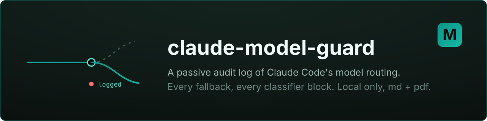

[](LICENSE)
[](#requirements)
[](#install)

# claude-model-guard

A Claude Code skill that passively logs how Claude Code has been **routing
models** — every Fable→Opus (or any real model) switch — plus auto-mode
classifier blocks, into reviewable **md + pdf** reports.

Use it **instead of toggling** the *"switch models when a message is flagged"*
setting: keep auto-switching on, but keep a record you can look back on.

> For **Claude Code** specifically. It reads Claude Code's own local session
> transcripts (`~/.claude/projects/*/*.jsonl`). It does **not** touch Cowork or
> any other surface, and it sends nothing anywhere — everything stays on your
> machine.

## What you get

Two reports in `~/.claude/claude-model-guard/`:

| File | Contents |
|---|---|
| `model-switch-log.md` / `.pdf` | Safety fallbacks (Fable→Opus), refusals not served by a fallback, and manual/routing switches (e.g. Opus↔Sonnet) |
| `auto-mode-blocks.md` / `.pdf` | Auto-mode safety-classifier denials, verbatim (separate; unrelated to routing) |

Updated automatically at **session end**, before **compaction**, and by a
**daily** scheduler (so multi-day sessions still refresh).

## Requirements

- **Node.js** (already required by Claude Code).
- **Branded PDF (recommended):** the **hq-report** skill installed at
  `~/.claude/skills/hq-report/` plus its deps (`pyyaml`, `markdown`, `weasyprint`).
  When present, reports render through hq-report's branded engine (dark cover,
  accent headings, styled tables) using this skill's teal theme at
  [`branding/report-brand.json`](branding/report-brand.json).
- **Fallback PDF:** `python` + `fpdf2` (`pip install fpdf2`) — a clean basic PDF
  when hq-report isn't installed.
- With no Python at all you still get the Markdown reports.

The renderer is chosen automatically: **hq-report → fpdf2 → Markdown-only**. Point
`CLAUDE_MODEL_GUARD_HQREPORT` at a `render-doc-pdf.py` to override discovery.

## Install

1. Copy this folder into your personal skills dir so Claude Code discovers it:
   - macOS/Linux: `~/.claude/skills/claude-model-guard/`
   - Windows: `%USERPROFILE%\.claude\skills\claude-model-guard\`
2. Run the installer:
   ```bash
   node ~/.claude/skills/claude-model-guard/scripts/install.mjs
   ```
   Options: `--dry-run` (preview only), `--time HH:MM` (daily time, default 23:30).
3. Restart Claude Code so the hooks load.

Or, inside Claude Code, just say **`/claude-model-guard`** (or "set up model-switch
logging") and it will run the installer for you.

The installer is idempotent and migration-safe: re-running replaces its own
hooks/scheduler instead of duplicating them.

### What the installer changes

- Adds `SessionEnd` + `PreCompact` hooks to `~/.claude/settings.json` (a
  timestamped backup is written first). Your other hooks are left untouched.
- Registers a daily job: Windows Scheduled Task `ClaudeModelGuard`, or a `cron`
  line on macOS/Linux (marked `# claude-model-guard`).
  - macOS note: if you prefer `launchd` over `cron`, wrap the same command in a
    LaunchAgent; the command is `node .../scan-model-switches.mjs --all --days 7`.
- Runs an initial scan so the reports exist right away.

## Uninstall

```bash
node ~/.claude/skills/claude-model-guard/scripts/uninstall.mjs         # keep the log
node ~/.claude/skills/claude-model-guard/scripts/uninstall.mjs --purge # delete the log too
```

## How it works

`scripts/scan-model-switches.mjs` walks the transcripts and maintains an
idempotent event DB (`state.json`); the md/pdf are regenerated from it on every
run, so all three triggers can run over overlapping data with no duplicates.

Fallbacks are detected the authoritative way, per Anthropic's
[Refusals-and-fallback spec](https://platform.claude.com/docs/en/build-with-claude/refusals-and-fallback):
a fallback-served assistant turn carries a `fallback` content block
(`{"type":"fallback","from":{model},"to":{model}}`) and a `fallback_message`
entry in `usage.iterations` (sticky-routed turns have only the latter). Naive
model-diffing between turns misses this, because the served turn's `message.model`
is already the fallback model. Manual/routing switches (Opus↔Sonnet) are still
caught via a real `claude-*` model change between turns; `<synthetic>`
continuation turns are ignored. Auto-mode blocks are matched only when a tool
result *starts with* the exact denial preamble (so quoted/echoed denial text in a
log read is not miscounted).

## Reason / category

A Fable→Opus fallback is recorded **definitively** (direction + timestamp). The
decline **category** (`cyber`, `bio`, `frontier_llm`, `reasoning_extraction`)
lives in `stop_details.category` on a `stop_reason:"refusal"` response — but the
spec says server-side fallback returns `stop_details: null` on the turn the
fallback model serves, so the category is present only on an **unserved** refusal.
The log stores the category whenever present, and otherwise the triggering prompt
as best-effort context. Auto-mode blocks carry verbatim reasons.

## Reference

- **Refusals and fallback** —
  <https://platform.claude.com/docs/en/build-with-claude/refusals-and-fallback>

## Layout

```
claude-model-guard/
  SKILL.md                     # skill manifest (triggers + instructions)
  README.md
  scripts/
    scan-model-switches.mjs    # parser + report rende